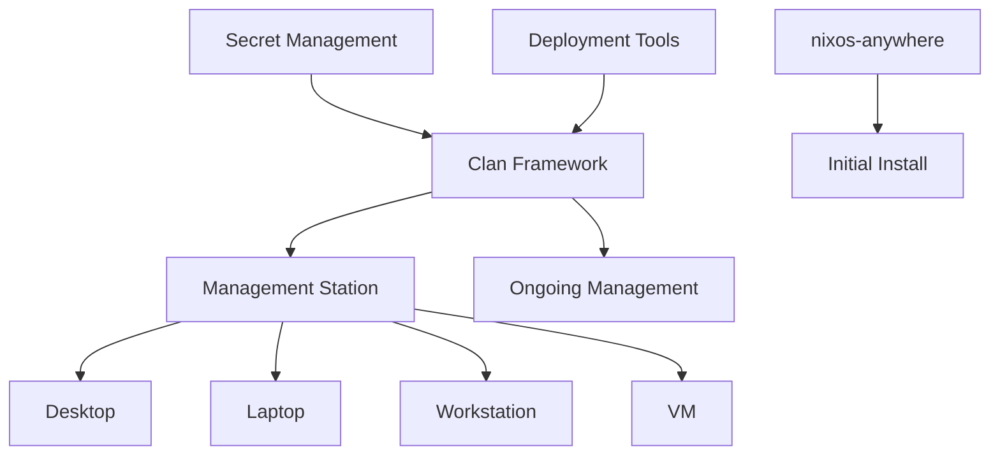
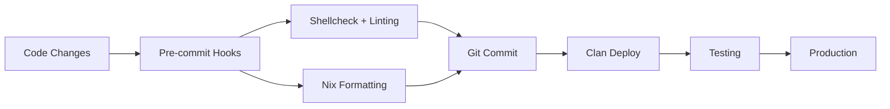
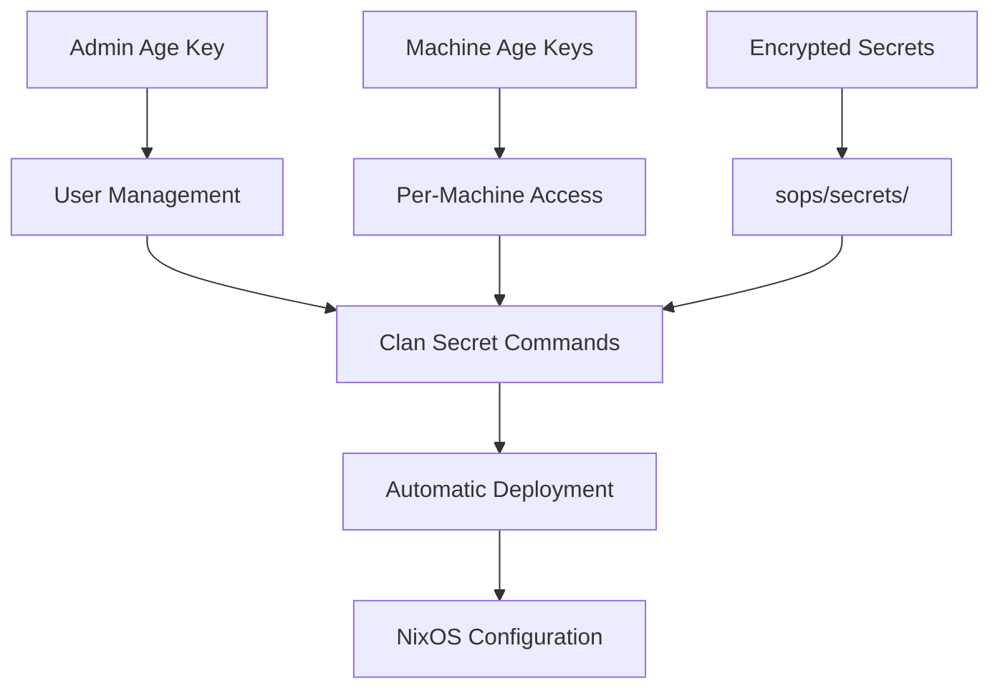

# Documentation Overview

Welcome to the comprehensive documentation for this NixOS configuration! This setup provides enterprise-grade infrastructure management with security, automation, and development excellence.

## 🚀 Quick Start

1. **New Users**: Start with the main [README.md](../README.md)
2. **Fresh Installation**: Use [Migration Guide](MIGRATION-GUIDE.md)
3. **Daily Operations**: See [Clan Workflows Guide](CLAN-WORKFLOWS.md)
4. **Development**: Check [Development Workflow](DEVELOPMENT.md)

## 📑 Documentation Structure

### Infrastructure Management

| Document | Purpose | Audience |
|----------|---------|----------|
| [**Clan Workflows**](CLAN-WORKFLOWS.md) | Daily operations, deployment, monitoring | Operators, DevOps |
| [**Migration Guide**](MIGRATION-GUIDE.md) | nixos-anywhere → Clan transition | System Admins |
| [**Clan Management**](CLAN-MANAGEMENT.md) | Complete framework reference | Advanced Users |

### Security & Development

| Document | Purpose | Audience |
|----------|---------|----------|
| [**Security Guide**](SECURITY.md) | Secret management, encryption | Security-focused |
| [**Development Workflow**](DEVELOPMENT.md) | Code quality, pre-commit hooks | Developers |
| [**Linting Reference**](LINTING.md) | Fast linting commands | Contributors |

## 🎯 Common Workflows

### 🏠 Home User
1. **Getting Started**: [Main README](../README.md) → [Migration Guide](MIGRATION-GUIDE.md)
2. **Daily Use**: [Clan Workflows](CLAN-WORKFLOWS.md) for updates
3. **Customization**: [Development Workflow](DEVELOPMENT.md) for modifications

### 🏢 Infrastructure Admin
1. **Deployment**: [Migration Guide](MIGRATION-GUIDE.md) → [Clan Management](CLAN-MANAGEMENT.md)
2. **Security Setup**: [Security Guide](SECURITY.md) for secret management
3. **Operations**: [Clan Workflows](CLAN-WORKFLOWS.md) for ongoing management

### 🛠️ Developer/Contributor
1. **Setup**: [Development Workflow](DEVELOPMENT.md)
2. **Quality**: [Linting Reference](LINTING.md)
3. **Advanced Features**: [Clan Management](CLAN-MANAGEMENT.md)

## 🔗 Key Concepts

### Infrastructure Architecture

### Development Process

### Secret Management

## 🛡️ Security Model

**Zero Trust Principles:**
- All secrets encrypted with age
- Per-machine access control
- No plaintext secrets in repository
- Automated secure deployment

**Access Levels:**
1. **Admin**: Full secret access, user management
2. **Machine**: Specific secret subset per machine
3. **Service**: Service-specific credentials only

## 🚀 Deployment Models

### Single Machine
- Use nixos-anywhere for bootstrap
- Switch to Clan for updates
- Local secret management

### Multi-Machine Fleet
- Centralized management from admin station
- Mesh networking between machines
- Distributed service deployment
- Coordinated updates and rollbacks

## 📊 Monitoring & Observability

**Current Status:**
- ✅ Deployment monitoring (Clan status)
- ✅ Configuration validation (pre-commit)
- ✅ Secret access control
- 🚧 Service health monitoring (planned)
- 🚧 Performance metrics (planned)

## 🔧 Troubleshooting Quick Reference

### Common Issues

| Issue | Quick Fix | Full Guide |
|-------|-----------|------------|
| Deployment fails | `--debug` flag | [Clan Workflows](CLAN-WORKFLOWS.md) |
| Linting errors | `pre-commit run --all-files` | [Linting Reference](LINTING.md) |
| Secret access denied | Check age keys | [Security Guide](SECURITY.md) |
| Machine unreachable | SSH connectivity test | [Migration Guide](MIGRATION-GUIDE.md) |

### Emergency Procedures

1. **System Recovery**: Use nixos-anywhere for full rebuild
2. **Secret Recovery**: Restore from age key backups
3. **Configuration Rollback**: Use Clan rollback commands
4. **Network Issues**: Reset mesh configuration

## 🎓 Learning Path

### Beginner → Intermediate
1. Deploy single machine successfully
2. Understand secret management basics
3. Use development workflow for customization
4. Deploy configuration changes confidently

### Intermediate → Advanced
1. Manage multi-machine fleet
2. Implement custom services
3. Set up monitoring and alerting
4. Contribute improvements back to configuration

## 📈 Roadmap

**Completed ✅**
- Clan integration with secret management
- Pre-commit hooks and code quality
- Comprehensive documentation
- Multi-machine deployment capability

**In Progress 🚧**
- Advanced service orchestration
- Monitoring and alerting stack
- Backup automation
- Performance optimization

**Planned 🔮**
- GUI management interface
- Advanced networking features
- Container orchestration
- Cloud integration

## 💡 Best Practices Summary

1. **Security First**: Always use encrypted secrets
2. **Test Before Deploy**: Use VM for testing changes
3. **Document Everything**: Keep runbooks updated
4. **Automate Quality**: Use pre-commit hooks
5. **Monitor Health**: Regular status checks
6. **Plan Recovery**: Test backup procedures

---

**Need Help?** Start with the most relevant guide above, or check the troubleshooting sections in each document. This setup is designed to grow with your needs while maintaining security and reliability! 🚀
